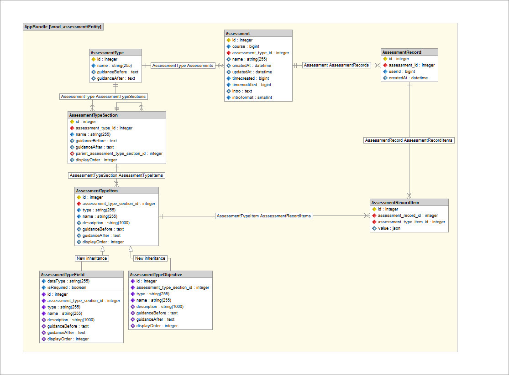

# GOV.UK Moodle Assessment activity

A GOV.UK Moodle activity module plugin implementing data collection and workflow for an Assessment activity.
Requirements are guided by the Social Work Practice Development Programme (SWPDP) and are subject to ongoing
enhancement through a User-Centred Design (UCD) approach.

**The Assessment activity module plugin has been created to run within a standard Moodle v4.5.5 installation.**

## Activity module plugin installation

### Manual setup

To use this Moodle activity module plugin, [download](https://github.com/DFE-Digital/govuk-moodle-assessment-activity/archive/refs/heads/development.zip)
and extract all files into your Moodle site's activity module plugin directory `/my-moodle-site/public/mod/assessment`.

All top-level files (`index.php`, `version.php`, etc) should be visible in `/my-moodle-site/public/mod/assessment`.

Moodle will detect the Assessment activity module plugin when started. Once installation is confirmed, the required Moodle
database tables are created:

- mdl_assessment
- mdl_assessment_record
- mdl_assessment_record_item
- mdl_assessment_type
- mdl_assessment_type_item
- mdl_assessment_type_section

Once installed, an Assessment activity can be added to any Moodle course by clicking **Add an activity or resource** and
selecting the newly-available **Assessment** activity.

## Business model

- When an Assessment activity is added to a Moodle course, an `Assessment` is created.
  - Each `Assessment` has a `name` (and other data) and is associated with one Moodle course and one `AssessmentType`.
- An `AssessmentType` has a `name` (and other data) and contains zero or more `AssessmentTypeSections`.
  - Each `AssessmentTypeSection` can be reordered within its `AssessmentType` by updating its `displayOrder`.
- An `AssessmentTypeSection` has a `name` (and other data) and contains zero or more `AssessmentTypeItems`.
  - Each `AssessmentTypeItem` can be reordered within its `AssessmentTypeSection` by updating its `displayOrder`.
- `AssessmentTypeItem` is a base class extended by a single class `AssessmentTypeField`, but this can be expanded to more subclasses if required.
- An `AssessmentTypeField` is a data field (text, textbox, date, checkbox) which is rendered for data collection.
- When a user completes an `Assessment`, an `AssessmentRecord` is created.
  - The `AssessmentRecord` is associated with one `Assessment` and one Moodle user.
  - It contains as many `AssessmentRecordItems` as there are `AssessmentTypeItems` associated with the `Assessment`'s `AssessmentType`.

## Technology

The Assessment activity module plugin leverages some well-tested [Symfony](https://symfony.com/) components which provide
routing, input forms/validation, database abstraction, security, performance caching and language translation.

Symfony fully adheres to the [Model-View-Controller](https://en.wikipedia.org/wiki/Model%E2%80%93view%E2%80%93controller) design pattern
and provides middleware components that support flexible and maintainable development of the Assessment activity module plugin.

The Asssessment activity provides custom functionality while retaining access to all core Moodle functionality, where required.
